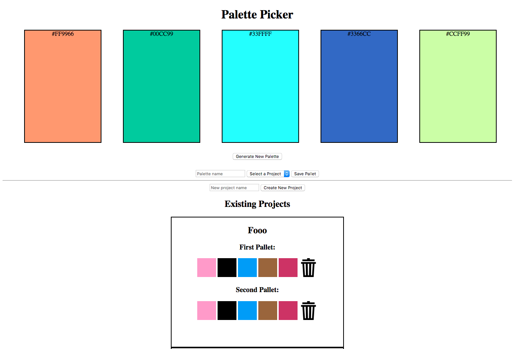

# Pallet Picker

## Description

There is a website out there called Coolors - and others like it are out there. They help you generate color palettes for websites or other design projects. This project aims to recreate some of this site’s functionality with my own backend and database. A user should be able to come to my site, generate a color palette, and save it for their own future projects.

## Set Up

### LIVE

Visit https://palette-picker-cy.herokuapp.com/ to view a live demonstration of the app!

### Front and Back End

Clone this repository.

Run `npm install` from the root directory.

Run `node server.js` to start the back-end.

Open localhost 3000 in a web browser to launch the front-end.

You can run the testing suite with `npm test`.

## Screenshot

